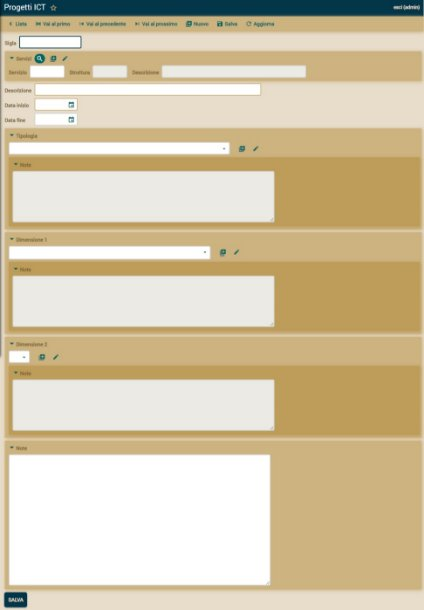
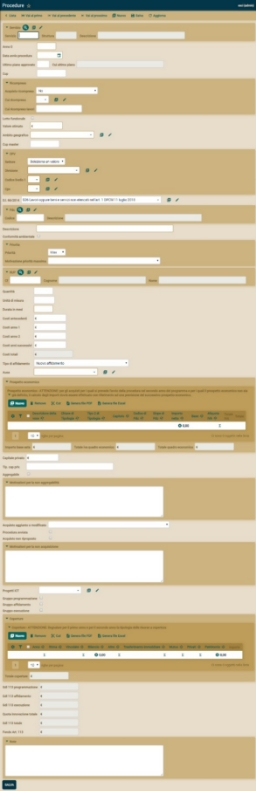

**1 REPOSITORY**

[regione-marche/prog-servizi](https://github.com/regione-marche/prog-servizi). Prog-servizi è il repoistory del sistema di raccolta degli interventi da realizzare tramite contratti pubblici di beni e servizi consente di redigere il relativo Programma

**2 DESCRIZIONE ESTESA**

**2.1 Contesto e casi d’uso**

|**ID:**|C01 |**Nome Use Case**|InserisceFabbisogno |
| :- | :- | :- | :- |
|**Breve descrizione**|Il RUP fornisce i dati fondamentali del contratto relativo ad un determinato fabbisogno |
|**Attori primari**|RUP, Incaricato |
|**Attori secondari**|RespSUAM |
|**Precondizioni**|Il sistema è nella finestra temporale prevista per l’inserimento del fabbisogno relativo al prossimo biennio come definito nel cronoprogramma ed Il RUP o Incaricato sono opportunamente profilati nel sistema |
|**FLUSSO PRINCIPALE**|
|
1. Il caso d'uso inizia quando il RUP ha raccolto i dati relativi al fabbisogno ovvero il quadro economico della spesa, il cronoprogramma, la previsione di copertura finanziaria e gli eventuali incentivi. 

2. Se il RUP ha le autorizzazioni e la competenza per inserire, allora procede direttamente altrimenti li comunica all’incaricato. 
|
|**Postcondizioni**|
1. I dati inseriti sono coerenti e completi. 

2. Il quadro economico è comprensivo degli incentivi per il GdL che possono essere calcolati e inseriti in automatico una volta che il quadro economico è stato inserito in maniera completa. Nel caso avvenga una modifica del quadro economico gli incentivi vengono eliminati automaticamente in modo da permettere all’utente di poterli ricalcolare sui nuovi totali. 

3. Alla chiusura della finestra temporale prevista per l’inserimento, sarà possibile avviare il caso d’uso “AggregaConsolida” 

4. È possibile definire i componenti del GdL e assegnare a ciascuno la sua quota di incentivo per ogni procedura inserita nel fabbisogno. 
|
|**Flussi alternativi**|nessuno |
|**Punti di estensione**|CaricaDaProgrammaCaricato: Consente di riprendere un intervento, previsto nell’ultima programmazione, eliminandolo o modificandolo, secondo le modalità previste dalla normativa. |

|**ID:**|C02 |**Nome Use Case**|AggregaConsolida |
| :- | :- | :- | :- |
|**Breve descrizione**|Il RespSUAM analizza i dati del fabbisogno aggregando, ove possibile gli interventi sotto i 40.000,00 euro e quindi provvede a pubblicare il programma**.** |
|**Attori primari**|RespSUAM |
|**Attori secondari**|RUP, Incaricato  |
|**Precondizioni**|i RUP hanno terminato la fase di inserimento del fabbisogno ovvero si è chiusa la relativa finestra temporale. |
|**FLUSSO PRINCIPALE**|
|
1. Il caso d'uso inizia quando il RespSUAM è nelle condizioni di analizzare il fabbisogno e quindi provvede ad aggregare, ove possibile, anche in contraddittorio con i rispettivi RUP, gli acquisti sotto i 40.000 Euro o anche altri comunque sotto soglia. 

2. Terminata l’operazione, il sistema consente di estrarre un tabulato (ovvero un foglio excel) da inserire nell’atto da sottoporre alla Giunta per la relativa approvazione. 

3. Approvato il piano, si procede con “PubblicaProgramma” 
|
|**Postcondizioni**|1. I dati prodotti sono coerenti e completi rispetto al fabbisogno.|
|**Flussi alternativi**|nessuno |
|**Punti di estensione**|nessuno |

|**ID:**|C03|**Nome Use Case**|PubblicaProgramma |
| :- | :- | :- | :- |
|**Breve descrizione**|Il RespSUAM provvede a inviare il programma su Prog Maggioli in stato di bozza.** |
|**Attori primari**|RespSUAM |
|**Attori secondari**||
|**Precondizioni**|Gli interventi sono stati tutti caricati e aggregati laddove ritenuto necessario. Sono stati inoltre indicati gli interventi avviati/non riproposti nel caso ci si trovi nella fase di prima pubblicazione. Se invece ci troviamo nella fase di modifica del programma sono stati modificati/cancellati tutti gli interventi.|
|**FLUSSO PRINCIPALE**|
|
1. Il caso d'uso viene incluso nel C02 e nel C04 ed inizia alla conclusione dello stesso. 

2. RespSUAM esegue la funzione di consolidamento del programma che quindi viene inviato nel sistema, aprendo la finestra temporale per eventuali successivi aggiornamenti; 

3. Il Programma viene caricato nel sistema Prog Maggioli per le successive operazioni di pubblicazione secondo le previsioni normative. 
|
|**Postcondizioni**|
1. Il programma è accessibile in consultazione.

2. tolto
|
|**Flussi alternativi**|nessuno |
|**Punti di estensione**|nessuno |

|**ID:**|C04|**Nome Use Case**|AggiornaProgramma |
| :- | :- | :- | :- |
|**Breve descrizione**|Il RespSUAM provvede a inviare il programma nel sistema Prog Maggioli|
|**Attori primari**|RespSUAM |
|**Attori secondari**|RespSUAM|
|**Precondizioni**|Ci si trova nella finestra temporale di modifica del programma come definito nel cronoprogramma|
|**FLUSSO PRINCIPALE**|
|
1. Il caso d'uso inizia quando il RUP ha la necessità di modificare nel corso dell’anno secondo le previsioni della normativa (al momento, l’art. 7 del DM n. 14/2018); 

2. Se il RUP ha le autorizzazioni e la competenza per inserire, allora procede direttamente altrimenti comunica i dati di modifica all’Incaricato.  
|
|**Postcondizioni**|nessuna |
|**Flussi alternativi**|nessuno |
|**Punti di estensione**|CaricaDaProgrammaCaricato: Consente di riprendere un intervento, previsto nell’ultima programmazione, eliminandolo o modificandolo, secondo le modalità previste dalla normativa.|

|**ID:**|C05|**Nome Use Case**|VerificaApprova |
| :- | :- | :- | :- |
|**Breve descrizione**|Il RespSUAM analizza le richieste di modifica e, se legittime, provvede a pubblicare il programma aggiornato**.** |
|**Attori primari**|RespSUAM |
|**Attori secondari**|RUP, Incaricato |
|**Precondizioni**|Sono presenti una o più richieste di modifica. |
|**FLUSSO PRINCIPALE**|
|
1. Il caso d'uso inizia quando sono presenti una o più richieste di modifica. 

2. Il RespSUAM analizza le diverse richieste, chiedendo integrazioni o chiarimenti laddove necessario: 

3. Al termine delle verifiche, si produce un nuovo tabulato e di procede con “PubblicaProgramma” 
|
|**Postcondizioni**|nessuna |
|**Flussi alternativi**|nessuno |
|**Punti di estensione**|nessuno |

|**ID:**|C06|**Nome Use Case**|ImpostaInterventoNonRiproposto\Avviato |
| :- | :- | :- | :- |
|**Breve descrizione**|Il sistema è nella finestra temporale prevista dal cronoprogramma in cui può impostare ad avviato / non riproposto gli interventi della programmazione precedente.** |
|**Attori primari**|RUP, Incaricato|
|**Attori secondari**|RespSUAM|
|**Precondizioni**|Sono presenti una o più richieste di modifica. |
|**FLUSSO PRINCIPALE**|
|
1. Il caso d'uso inizia quando il RUP vuole impostare lo stato degli interventi della programmazione passata; 

2. Se il RUP ha le autorizzazioni e la competenza per inserire, allora procede direttamente altrimenti li comunica all’incaricato. 
|
|**Postcondizioni**|Gli interventi si trovano nel nuovo stato e possono essere inviati al Prog Maggioli |
|**Flussi alternativi**|nessuno |
|**Punti di estensione**|CaricaDaProgrammaCaricato: Consente di riprendere un intervento, previsto nell’ultima programmazione, eliminandolo o modificandolo, secondo le modalità previste dalla normativa.|

|**c**|C07|**Nome Use Case**|DefinisceCronoprogramma|
| :- | :- | :- | :- |
|**Breve descrizione**|Il responsabile SUAM ad inizio anno vuole definire il cronoprogramma che regolamenterà l’apertura e chiusura delle varie fasi individuate per la raccolta, modifica e pubblicazione del fabbisogno.** |
|**Attori primari**|RespSUAM|
|**Attori secondari**|RUP, Incaricato|
|**Precondizioni**|nessuna |
|**FLUSSO PRINCIPALE**|
|
1. Il caso d'uso inizia quando il RespSUAM creare il cronoprogramma per la nuova programmazione biennale.

2. Il RespSUAM inserisce le date di apertura e chiusura delle varie fasi della programmazione. 
|
|**Postcondizioni**|Il cronoprogramma è correttamente salvato. |
|**Flussi alternativi**|nessuno |
|**Punti di estensione**|nessuno|

|**c**|C08|**Nome Use Case**|ArchiviaInterventi|
| :- | :- | :- | :- |
|**Breve descrizione**|Il responsabile SUAM vuole archiviare l’intera programmazione dopo aver fatto una pubblicazione (sia che si tratti di prima pubblicazione che di modifica).** |
|**Attori primari**|RespSUAM|
|**Attori secondari**|RUP, Incaricato|
|**Precondizioni**|Sia stata fatta una pubblicazione terminata con successo. |
|**FLUSSO PRINCIPALE**|
|
1. Il caso d'uso inizia quando il RespSUAM ha effettuato una pubblicazione con successo.

2. Il RespSUAM aziona l’apposita funzione di archiviazione;

3. Gli interventi sono cristallizzati allo stato dell’ultima pubblicazione e consultabili nell’archivio. Le varie sezioni sono pulite dagli interventi archiviati e pronte per essere di nuovo utilizzate dai RUP/incaricati
|
|**Postcondizioni**|L’ultima pubblicazione è archiviata e gli interventi sono consultabili nell’archivio. |
|**Flussi alternativi**|nessuno |
|**Punti di estensione**|nessuno|

|**c**|C09|**Nome Use Case**|AccorpamentoModificaInterventi|
| :- | :- | :- | :- |
|**Breve descrizione**|Il RespSUAM analizza i dati delle modifiche interventi aggregando, ove possibile gli interventi sotto i 40.000,00 euro e quindi provvede a pubblicare il programma**.**|
|**Attori primari**|RespSUAM |
|**Attori secondari**|RUP, Incaricato  |
|**Precondizioni**|i RUP hanno terminato la fase di modifica del fabbisogno e c’è la ncessità di effettuare una nuova pubblicazione. |
|**FLUSSO PRINCIPALE**|
|
1. Il caso d'uso inizia quando il RespSUAM è nelle condizioni di analizzare i dati modificati degli interventi e quindi provvede ad aggregare, ove possibile, anche in contraddittorio con i rispettivi RUP, gli acquisti sotto i 40.000 Euro o anche altri comunque sotto soglia. 

2. Terminata l’operazione, il sistema consente di estrarre un tabulato (ovvero un foglio excel) da inserire nell’atto da sottoporre alla Giunta per la relativa approvazione. 

3. Approvato il piano, si procede con “PubblicaProgramma”
|
|**Postcondizioni**|I dati prodotti sono coerenti e completi rispetto alle modifiche del fabbisogno.|
|**Flussi alternativi**|nessuno |
|**Punti di estensione**|nessuno|

|**ID:**|C10|**Nome Use Case**|GestioneReferenti |
| :- | :- | :- | :- |
|**Breve descrizione**|Gli utenti con credenziali Cohesion che fanno il primo accesso al sistema possono inserire una richiesta di abilitazione per un determinato servizio e con un determinato profilo. La richiesta di abilitazione perviene al responsabile del servizio che può accettarla o meno. Una volta che la richiesta viene accettata il nuovo utente può operare autonomamente all’interno del sistema. L’utente responsabile di servizio può inoltre gestire tutti gli accessi al sistema del suo servizio disabilitando utenti con permessi attivi o abilitando utenti del suo servizio già censiti a sistema. |
|**Attori primari**|Incaricato  |
|**Attori secondari**|Nessuno  |
|**Precondizioni**|L’utente incaricato abbia credenziali Cohesion per effettuare il primo accesso|
|**FLUSSO PRINCIPALE**|
|
4. Il caso d'uso inizia quando il l’utente Incaricato effettua il primo accesso alla piattaforma. L’utente deve inserire i dati utente minimi e può effettuare una richiesta di abilitazione all’utilizzo della piattaforma per un determinato servizio e un determinato profilo

5. L’Utente Incaricato inquadrato come responsabile di servizio viene notificato dal sistema di una nuova richiesta di abilitazione

6. Il responsabile di servizio accede e gestisce la nuova richiesta dando consenso o diniego alla richiesta 
|
|**Postcondizioni**|
2. L’Utente Incaricato che ha ottenuto il permesso di accesso può iniziare ad utilizzare il sistema.

3. L’Utente Incaricato che ha ottenuto il diniego può effettuare una nuova richiesta di accesso.
|
|**Flussi alternativi**|nessuno |
|**Punti di estensione**|nessuno |

**2.2 Finalità del software**

Il sistema di raccolta degli interventi da realizzare tramite contratti pubblici di beni e servizi consente di redigere compiutamente il “Programma Biennale degli acquisti di beni e servizi” ai sensi dell’art. 21 del D.Lgs. n50/2016 e del “Regolamento recante procedure e schemi-tipo per la redazione e la pubblicazione del programma triennale dei lavori pubblici, del programma biennale per l'acquisizione di forniture e servizi e dei relativi elenchi annuali e aggiornamenti annuali” adottato con decreto n°14 del 16 gennaio 2018 dal Ministro delle Infrastrutture e dei trasporti di concerto con il Ministro dell’economia e delle finanze (nel seguito DM 14/2018).

In particolare, il sistema consente ai RUP ex art. 31 del D.Lgs. n.50/2016, immediatamente dopo l’approvazione del bilancio triennale di previsione, di:

1) Inserire in apposite “schede intervento”, strutturate in analogia ai Prospetti Economici proposti da ITACA, i valori qualificativi e quantificativi essenziali di tutti i progetti che si intendono realizzare nel biennio, indipendentemente dal loro valore, in coerenza a quanto approvato dalla Giunta Regionale nel Bilancio Finanziario gestionale (BFG);
1) Aggiornare motivatamente l’ultimo programma approvato ovvero:
1) confermare gli interventi già avviati, inserendo i riferimenti al codice gara assegnato dal sistema GT-SUAM e la data di avvio della relativa procedura di affidamento;
1) eliminare gli eventuali interventi che non si intendono riproporre indicandone una breve motivazione, secondo quanto previsto dalla tabella C del DM 14/2018;
1) confermare o modificare i valori degli eventuali previsti per l’anno corrente;

In base ai valori inseriti dai RUP, il Responsabile Regionale del Programma potrà:

1) identificare eventuali interventi accorpabili in un'unica procedura di affidamento;
1) redigere e pubblicare il programma biennale secondo la normativa vigente.

Successivamente alla pubblicazione, il sistema consente di consultare il programma approvato e le strutture delegate a svolgere le procedure di affidamento (SUAM, Provveditorato, Informatica o struttura committente) potranno programmare le rispettive attività annuali, in base ai carichi di lavoro previsti ed alle priorità che ciascun RUP avrà indicato nelle relative schede di intervento.

**2.3 Screenshoot**

*Figura 1: schermata di accesso al sistema*

Il lavoro svolto ha visto, per prima cosa, la creazione di varie classi java, sulla base del modello E-R fornitoci dai referenti della Regione, per consentire lo sviluppo delle funzionalità previste per il sistema. 

Il framework utilizzato per l’implementazione del sistema è OpenXava, una AJAX Java Framework che consente lo sviluppo di applicazioni enterprise in maniera molto rapida. Siamo partiti generando delle classi che rispecchiassero le entità presenti nel modello E-R, tramite il framework, siamo poi passati alla generazione automatica sia del database (DB Postgress) che delle form di inserimento, gestione e reportistica dei dati, velocizzando sensibilmente i tempi di realizzazione. Il framework permette inoltre di inserire funzioni di formattazione/validazione dei dati inseriti.

Esaminando il sistema dal punto di vista degli utenti, possiamo notare che i dipendenti che hanno effettuato l’accesso al sistema possono entrare nel portale e caricare le informazioni relative ai progetti o alle procedure che stanno seguendo e sui quali stanno lavorando, completi di tutte le informazioni richieste. 

Nello specifico il flusso del sistema prevede che il RUP inserisca all’interno del sistema il progetto al quale sta lavorando, completo di tutti i dati che lo contraddistinguono, tramite la maschera Progetti ict (Figura 2). 

*Figura 2: schermata inserimento Progetti ICT*

Una volta inserito il progetto, il RUP può passare alla compilazione di tutti i dati relativi alla procedura selezionando il progetto al quale la procedura fa riferimento (solo per la P.F. Informatica, le altre P.F. non inseriscono progetti). Ogni procedura si riferisce ad un progetto (o nessuno), ma un progetto può essere indicato su più procedure.  

Per questo inserimento è necessario compilare i campi previsti dalla schermata di inserimento Procedure (Figura 3). Oltre al semplice inserimento sono state implementate due funzioni che permettono la duplicazione della procedura: una funzione genera una copia di una procedura esistente senza salvare in automatico il tutto, di modo che l’utente prima di salvare possa apportare delle modifiche; la seconda funzione permette di creare una copia esatta della procedura cambiando solo l’anno0 di riferimento, funzionalità utile nel caso in cui ci siano procedure da replicare su più anni.

Questi dati, al loro primo inserimento, costituiscono il cosiddetto “Fabbisogno” e devono essere successivamente validati ed approvati dal un utente Amministratore che li elabora in modo da farli entrare nella “Programmazione” regionale. Alle procedure che entrano a far parte della programmazione viene assegnato un codice univoco, il CUI, che le identificherà per tutto il loro ciclo di vita. 

L’amministratore può selezionare le procedure da inserire nella “Programmazione” direttamente tra quelle del “Fabbisogno” assegnandogli il CUI e modificandole come ritiene opportuno. Per distinguere le procedure del Fabbisogno da quelle della Programmazione sono state create due diverse entità. Per facilitare l’operato dell’amministratore è stata inserita una funzione che permette la copia di una procedura nella sua interezza tra le due entità, inserendo come unico parametro il codice CUI.

Una volta che la Programmazione è stata completamente validata dall’amministratore i RUP possono entrare di nuovo nel sistema per modificare/inserire/cancellare le procedure, motivando dettagliatamente la modifica.

Dopo questa seconda fase di modifica da parte dei RUP ci sarà una nuova fase di controllo/validazione da parte dell’amministratore che dovrà verificare la correttezza delle procedure modificate e assegnare nuovi CUI alle procedure nuove inserite direttamente in programmazione.

Tutte le procedure della Programmazione che sono state validate dall’amministrazione, a fine anno entrano a fa parte della “Programmazione definitiva”.

In figura 3 è rappresentata la schermata di inserimento delle procedure del Fabbisogno, analoga alla schermata di inserimento delle procedure della Programmazione eccetto per le “motivazioni” di modifica/inserimento/cancellazione che i RUP devono obbligatoriamente inserire in quest’ultime.

*Figura 3: schermata inserimento Procedure*

Per ogni procedura, il RUP deve poi passare ad inserire i Gdl 113, utilizzando l’apposita schermata (Figura 4). 

*Figura 4: schermata inserimento Gdl 113*

Ogni procedura ha tre righe di Gdl 113 corrispondenti alle tre fase in cui la procedura può trovarsi: esecuzione, affidamento e programmazione. Per ogni fase deve essere indicato il personale regionale che ha lavorato alla fase in questione, in questo modo si tiene traccia di tutti i dipendenti che, a vario titolo, hanno lavorato sul progetto e si calcolano gli incentivi da riconoscere a ciascuno di essi. I vari importi vengono calcolati in automatico dal sistema in base a coefficienti prestabiliti. Le entità principali individuate in questo flusso sono quindi i Progetti, le Procedure (sia del Fabbisogno che della Programmazione) e il Gdl113.

**2.4 Links**

Il link al progetto è raggiungibile solo da intranet Regione Marche [http://prog-servizi.regionemarche.intra](http://prog-servizi.regionemarche.intra/ProgrammaBiennale/)

**3 DOCUMENTAZIONE AGGIUNTIVA**

<http://prog-servizi.regionemarche.intra/ProgrammaBiennale2020/naviox/files/ISTRUZIONI%20ProgBien.pdf>

**4 STRUTTURA DEL REPOSITORY**

Nel repository è attualmente presente un unico brach con un’unica directory principale contenente la soluzione.

**5 PREREQUISITI E DIPENDENZE**

1. Installazione Java 11 o Java 8
1. Installazione Tomcat dalla versione 7 in poi (non necessario se si utilizza Eclipse)
1. Installazione di PosgreSQL ultima versione (o altro database compatibile con XavaPRO)
1. Installazione IDE Eclipse. Per lo sviluppo dell’applicazione prog-servizi è stato usato Eclipse IDE for Enterprise Java Developers Version: 2020-03 (4.15.0) Build id: 20200313-1211.

**6 ISTRUZIONI PER L’INSTALLAZIONE**

Per installare prog-servizi su Eclipse basta scaricare il repository e si ha immediatamente a disposizione un ambiente pronto per iniziare lo sviluppo comprensivo di Tomcat e uno spazio di lavoro Eclipse, tutti configurati e pronti per l'uso. 

Prog-servizi è stato sviluppato con XavaPRO, che può lavorare su base di dati Open Source MySQL, PostgreSQL, Oracle, DB2, MS SQL Server ecc. Per questo progetto è stato scelto PosgreSQL in quanto la regione marche possiede già un db server Postgre. Per poter utilizzare questo database il primo passo è stato installare su Eclipse il driver JDBC più aggiornato che si può gratuitamente scaricare in rete. Successivamente sono stati creati due database schema per le applicazioni di test e produzione. Infine i due ambienti di test e produzione sono stati configurati per chiamare questi due diversi schema tramite le opportune stringhe di connessione.

Una volta terminato lo sviluppo dell’applicazione tramite l’IDE Eclipse è possibile generare il file .war necessario per l’installazione dell’applicativo sui server di test e produzione. Questi file .war vanno inseriti nella cartella webapps di Tomcat e vengono installati automaticamente al riavvio del Server. Per generare il file .war occorre lanciare da Eclipse il file build.xml del progetto che si è sviluppato.

**6.1 Manuale sviluppo**

**Architettura XavaPRO**

OpenXava (XavaPRO nella versione licensed utilizzata in questo progetto) è un framework per lo sviluppo rapido di applicazioni aziendali che utilizzano Java. È facile da implementare e permette di realizzare un'applicazione in pochissimo tempo. Allo stesso tempo, OpenXava è estensibile, personalizzabile e il codice dell'applicazione è strutturato in un modo molto puro orientato agli oggetti, cosa che consente di sviluppare applicazioni arbitrariamente complesse.

OpenXava utilizza un approccio di sviluppo guidato dal modello, in cui il nucleo dell’applicazione sono classi Java che modellano il problema: questo approccio garantisce una grande produttività mantenendo comunque un alto livello di incapsulamento. Si basa su due filosofie ben note: la metodologia di Model-Driven Development (MDD) e il concetto di Business Component. 

Fondamentalmente, MDD afferma che solo il modello di un'applicazione deve essere sviluppato, e il resto viene generato automaticamente: nel contesto di MDD il modello è il mezzo per rappresentare i dati e la logica dell'applicazione e può essere una notazione grafica, come UML, o una notazione testuale come una DSL (Domain-Specific Language).

Sfortunatamente, usare MDD è molto complesso e richiede un grande investimento di tempo, esperienza e strumenti. OpenXava semplifica questa metodologia utilizzando classi Java con annotazioni semplici per definire il modello, e invece di generare codice, tutte le funzionalità sono generate dinamicamente in fase di runtime:

|**Model definition**|**Application generation**|
| -: | :- |
|**Classic MDD**|UML/DSL|Code generation|
|**OpenXava**|Simple Java classes|Dynamically at runtime|

Da semplici classi Java si ottiene un'applicazione a tutti gli effetti. 

Una Business Component è semplicemente un modo di organizzare il software: il modo ortogonale di sviluppo del software è il paradigma di MVC (Model-View-Controller) in cui il codice è suddiviso in compartimenti per dati (modello), interfaccia utente (vista) e logica (controller).

Tutte le unità di codice associate alla creazione dell'interfaccia utente, come le pagine JSP, JSF, Swing, JavaFX, ecc., sono tenute strettamente insieme nel livello di view e, analogamente, per i livelli del model e del controller. 

In un’applicazione OpenXAVA oltre alle Business Components, ci sono moduli, controller, editor, validatori e calcolatori:

- **Business Component:** classi Java che descrivono tutti gli aspetti dei concetti business. 
- **Moduli:** un modulo è ciò che l'utente finale vede. È l'unione di una Business Component e di diversi controller. 
- **Controller:** un controller è una raccolta di azioni. Da un punto di vista dell'utente, le azioni sono pulsanti o collegamenti su cui può fare clic; per lo sviluppatore, sono le classi contenenti la logica del programma da eseguire quando si fa clic su quei pulsanti. I controllori definiscono il comportamento dell'applicazione e possono essere riutilizzati in diversi moduli dell'applicazione. OpenXava viene fornito con un set di controller predefiniti per molte attività quotidiane e, naturalmente, è anche possibile definire i propri controller personalizzati.
- **Editor:** gli editor sono componenti dell'interfaccia utente che specificano in che modo diversi membri e attributi del componente aziendale vengono visualizzati e modificati. Forniscono un mezzo per estendere e personalizzare l'interfaccia utente.
- **Validatori:** logica di convalida riutilizzabile che è possibile utilizzare in qualsiasi componente aziendale.
- **Calcolatori:** logica di business riutilizzabile che può essere utilizzata in varie parti dei Business Component, ad es. per generare valori predefiniti.

**Configurazione dell’ambiente**

Una volta scaricato il repository del progetto basterà aprire il workspace con l’IDE Eclipse e sarà possibile iniziare immediatamente a sviluppare. Il workspace si presenterà come in figura:

Nella cartella Servers ci sono tutti i file di configurazione di Tomcat per l’accesso al server di produzione\locale o al database di produzione\locale. In particolare nel file server.xml sono specificate le porte di accesso e i dns locali necessari al funzionamento (in locale) dell’applicazione e di cohesion:

<Context docBase=*"CohesionServlet"* path=*"/CohesionServlet"* reloadable=*"true"* source=*"org.eclipse.jst.jee.server:CohesionServlet"*/>

<Context docBase=*"ProgrammaBiennale2020"* path=*"/ProgrammaBiennale2020"* reloadable=*"true"* source=*"org.eclipse.jst.jee.server:ProgrammaBiennale2020"*/>

Nel file context.xml invece sono invece presenti le stringhe di connessione ai database.

<Resource name=*"jdbc/ProgrammaBiennale2020DS"* auth=*"Container"* removeAbandoned=*"true"* removeAbandonedTimeout=*"55"* testOnBorrow=*"true"* testWhileIdle=*"true"* testOnReturn=*"true"* validationQuery=*"SELECT 1"* validationInterval=*"34000"*  type=*"javax.sql.DataSource"* maxActive=*"20"* maxIdle=*"5"* maxWait=*"10000"* username=*"postgres"* password=*"\*\*\*\*\*\*\*\*\*"* driverClassName=*"org.postgresql.Driver"* url=*"jdbc:postgresql://localhost:5432/PT"*/>		

Se invece ci spostiamo nella solution ProgrammaBiennale2020 nella cartella persistence/META-INF si trova il file persistence.xml che contiene tutte le informazioni di configurazione di Tomcat + Hypersonic e Junit e dove sono richiamate alcune classi necessarie al corretto funzionamento dell’applicativo e le informazioni relative al provider Postgres (con relative properties).

Queste classi sono per Hypersonic:

<class>org.openxava.session.GalleryImage</class>

<class>org.openxava.web.editors.DiscussionComment</class>

<class>org.openxava.util.impl.EmailSubscription</class>

Queste classi sono per Junit:

<class>org.openxava.web.editors.DiscussionComment</class>

<class>org.openxava.util.impl.EmailSubscription</class>

**Struttura della solution**

In src troviamo tutti i package di sviluppo suddivisi in base alla suddivisione OpenXAVA:

- Action contiene le classi contenenti la logica dei controller
- Calculators contiene tutti i calcolatori di valori di default
- com.openxava.naviox.model contiene tutte le classi di XavaPRO (fornito con codice sorgente) e non è stata toccata.
- Filters contiene tutte le classi usate per i filtri di accesso utente e altri filtri
- ProgBien contiene tutte le classi del modello
- Util contiene classi con metodi statici globalmente utili nell’applicativo
- WebAPI contiene tutte le classi necessarie alla comunicazione con il webservice di prog Maggioli (sviluppato con le librerie Java Retrofit e Jackson).

In properties troviamo alcuni file di configurazione. Per lo sviluppo ci interessano application.properties che contiene variabili configurabili utilizzate globalmente dall’applicazione e richiamate dalla classe *ProgrammaBiennalePreferences* (cartella Utils), e xava.properties dove si può configurare il framework OpenXAVA (SMTP, aspetto, comportamento ecc..).

In xava troviamo application.xml e controllers.xml che servono per la configurazione dei controller, in particolare per definire come le entità richiamino le classi actions.

In i18n troviamo i file per la tradizione di tutte le varie risorse della soluzione (label, tooltips ecc…) e dei messaggi (Errori, eccezioni ecc..).

Web contiene tutta la parte web dell’applicazione, non va modificata. A parte alcune personalizzazioni che sono state fatte per la maschera di login e la welcome page per l’integrazione di cohesion.

Il file build.xml è il file che serve per la creazione del .war della solution: basta cliccare con il tasto destro e scegliere Run As dal menu a tendina e selezionare Ant Build. Il file war verrà generato nella solution nella cartella \workspace.dist\ProgrammaBiennale2020.dist con il nome ProgrammaBiennale2020.war.

**Creazione di un nuovo modulo**

Per la creazione di un nuovo modulo occorre definire una classe @Entity all’interno della cartella ProgBien. Una volta creata la classe quindi bisogna aggiungere il tag @Entity e tutte le varie properties necessarie. Per ogni property definita il framework genererà un’interfaccia in cui i tipi accettati dipendono dal tipo dichiarato per la property. Se dichiaro una property di tipo int la textbox generata accetterà solo numeri. 

Per ogni modulo esitono due tipi di visualizzazione, uno lista in cui compaiono tutti record inseriti, e l’altro dettaglio che si apre selezionando un record dalla lista.

Questo è un esempio di classe (la classe per i Nuts) con relativa schermata della classe generata.

**package** ProgBien;

**import** javax.persistence.\*;

**import** org.openxava.annotations.\*;

@Entity

**public** **class** Nuts {

`	`@Id

`	`@Required

`    `@Column(name = "Codice", length = 11, nullable = **false**)

`    `**private** String codice;	

`	`@Required

`    `@Column(name = "Descrizione", length = 50, nullable = **false**)

`    `**private** String descrizione;

`	`@Required

`    `@Column(name = "Tipo", length = 6, nullable = **false**)

`    `**private** String tipo;

`	`**public** String getCodice() {

`		`**return** codice;

`	`}

`	`**public** **void** setCodice(String codice) {

`		`**this**.codice = codice;

`	`}

`	`**public** String getDescrizione() {

`		`**return** descrizione;

`	`}

`	`**public** **void** setDescrizione(String descrizione) {

`		`**this**.descrizione = descrizione;

`	`}

`	`**public** String getTipo() {

`		`**return** tipo;

`	`}

`	`**public** **void** setTipo(String tipo) {

`		`**this**.tipo = tipo;

`	`}

}

Di default il modulo generato prende il nome dal nome della classe. Nella stampa del nome della classe le lettere maiuscole verranno interpretate come una nuova parola: se chiamo una classe procedureProgramma il nome del modulo visualizzato sarà “Procedure programa”.

La sintassi per definire una property è la seguente:

@Stereotype                                                                *//  1*

@Column(length=) @Column(precision=) @Max @Length(max=) @Digits(integer=)  *//  2*

@Digits(integer=) @Digits(fraction=)                                       *//  3*

@Required @Min @Range(min=) @Length(min=)                                  *//  4*

@Id                                                                        *//  5*

@Hidden                                                                    *//  6*

@SearchKey                                                                 *//  7*

@Version                                                                   *//  8*

@Formula                                                                   *//  9  New in v3.1.4*

@Calculation                                                               *// 10  New in v5.7*

@DefaultValueCalculator                                                    *// 11*

@PropertyValidator                                                         *// 12*

**private** type propertyName;                                                 *// 13*

**public** type getPropertyName() { ... }                                      *// 13*

**public** **void** setPropertyName(type newValue) { ... }                         *// 13*

I metodi get{} e set{} sono fondamentali in quanto senza di questi non verrà generato il relativo componente della property nell’interfaccia.

**Creazione di una action**

Una action si compone di un controller e di una classe in cui viene definita appunto “l’azione” che viene compiuta quando questa viene richiamata. Graficamente parlando una action si traduce in un bottone che una volta cliccato andrà a lanciare una determinata azione. 

Esempi di dichiarazione di una classe action:

**package** actions;

**import** java.util.\*;

**import** org.openxava.actions.\*;

**import** org.openxava.jpa.\*;

**import** org.openxava.model.\*;

**import** ProgBien.\*;

**import** util.\*;

**public** **class** UpdateCoperture **extends** OnChangePropertyBaseAction {

`	`**public** **void** execute() **throws** Exception {

`		`…

}

}

E relativo controllo inserito nel file controllers.xml

<controller name=*"Procedure"*>

<extends controller=*"Typical"*/>

…

<action name="save" class="actions.UpdateCoperture" 

mode="detail" 

`	`image="save.gif"

`	`icon="content-save" 

`	`keystroke="Control S" />	

…

</controller>

Il nome del controller corrisponde al nome dell’entity.

**Creazione di un calculator**

Un calculator è una classe che viene richiamata da una property di una entity e che permette di effettuare dei calcoli automatici (ad esempio inserire un valore di default)

Esempio di calculator

**package** Calculators;

**import** javax.persistence.\*;

**import** org.openxava.calculators.\*;

**import** org.openxava.jpa.\*;

**import** org.openxava.util.\*;

**import** ProgBien.\*;

**public** **class** CurrentUserCalculator **implements** ICalculator {

`	`/\*\*

`	 `\* 

`	 `\*/

`	`**private** **static** **final** **long** ***serialVersionUID*** = 1L;

`	`**public** Object calculate() **throws** Exception {

`		`String username = Users.*getCurrent*();

`		`**if** (!username.equals("admin"))

`		`{

`			`Query query = XPersistence.*getManager*().createQuery("from Dipendenti i where i.cf like :cf");			      

`		    `query.setParameter("cf", username);

`		    `Dipendenti d = **null**;

`		    `**try** {

`		    	`d = (Dipendenti)query.getSingleResult();

`		    `}

`		    `**catch** (NoResultException nre) {

`		    	`//Ignore this because as per your logic this is ok!

`		    	`}

`		    `**return** d;

`		`}

`		`**else** **return** "";	    

`	  `}

`	`}

Esempio di property che richiama il calulator

@ReadOnly

@Required

@ManyToOne( // The reference is persisted as a database relationship

`            `fetch=FetchType.***LAZY***, // The reference is loaded on demand

`            `optional=**false**) // The reference can have no value

@DefaultValueCalculator(value=CurrentUserCalculator.**class**)

@DescriptionsList(

`    		`descriptionProperties="cf, nome, cognome") // Thus the reference is displayed using a combo

**private** Dipendenti dipendenti; // A regular Java reference

**Creazione di un Filter**

Un filter permette di filtrare i risultati visualizzati nella pagina di lista delle entity in base a delle regole ben definite. Questo deve essere richiamato dalla classe enity attraverso il tag @Tabs.

@Entity 

@Tabs({

`	`@Tab(

`		`//name="Current",

`		`filter=CurrentUserServizioStrutturaRupFilter.**class**,

`		`//properties="servizio, struttura, descrizione, codicesicurezza, datainizio, datafine, nstruttura, nservizio, inquadrato",

`		`baseCondition="${deleted} = false and ${archived} = false and ${servizi.servizio} like ? and ${servizi.struttura} like ? and ${dipendenti.cf} like ?",

`		`properties="stato.descrizione, servizi.servizio, servizi.struttura, dipendenti.cf, dipendenti.cognome," + 

`				`"anno0, descrizione, ultimopianoapprovato.cui, valoreStimatoAppalto, importoBaseAsta, totaleQuadroEconomico, totaleIvaQuadroEconomico, costipregressi, totaleCoperture, costoTotale"

`	`),

`	`@Tab(name="Deleted", baseCondition = "${deleted} = true") // A named tab

`	`,

`	`@Tab(name="Archived", baseCondition = "${archived} = true and ${deleted} = false") // A named tab

})

@Audited

**public** **class** Procedure **extends** Deletable

Esempio di classe filter 

**package** Filters;

**import** java.util.\*;

**import** javax.persistence.\*;

**import** org.openxava.filters.\*;

**import** org.openxava.jpa.\*;

**import** org.openxava.util.\*;

**import** ProgBien.\*;

@SuppressWarnings("serial")

**public** **class** CurrentUserServizioStrutturaRupFilter **extends** BaseContextFilter **implements** IFilter {

`	 `**public** Inquadrato getUserInquadrato(String cf) {

`		 `Date data = **new** Date();

`		 `Query query = XPersistence.*getManager*().createQuery("from Inquadrato i where i.dipendenti.cf like :cf and i.datainizio <= :data and i.datafine >= :data");			      

`			    `query.setParameter("cf", cf);

`			    `query.setParameter("data", data);			    

`			    `Inquadrato i = **null**;

`			    `**try** {

`			    	`i = (Inquadrato)query.getSingleResult();

`			    `}

`			    `**catch** (NoResultException nre) {

`			    	`//Ignore this because as per your logic this is ok!

`			    	`}

`			    `**return** i;

`			    `/\*

`			    	`return i.getServizi().getServizio();

`			    `else

`			    	`return "%%";

`			    `\*/

`	 `}

`	 `**public** Object filter(Object o) **throws** FilterException { // (2)		 

`		 `String username = Users.*getCurrent*();

`		 `Inquadrato i = getUserInquadrato(username);				

`		 `String servizio = "%%";		 

`		 `String struttura = "%%";	

`		 `String usr = "%%";

`		 `String ruolo = "";

`		 `**if** (!util.ProgBienUtils.*checkAdmin*() && i == **null**)

`		 `{

`			 `servizio = "error";		 

`			 `struttura = "error";

`			 `usr = "error";

`		 `}

`		 `**if** (i != **null** && !util.ProgBienUtils.*checkAdmin*())

`		 `{		 	

`			 `**if** (i.getProfilo() == **null**)

`			 `{

`				 `**if** (i.getDipendenti().isRup())

`				 `{

`					 `ruolo = "RUP";

`					 `usr = i.getDipendenti().getCf();

`				 `}

`			 `}

`			 `**else**

`			 `{

`				 `ruolo = i.getProfilo().getKey();

`			 `}

`			 `**if** (!ruolo.isEmpty())

`			 `{

`				 `**switch** (ruolo) {

`		            `**case** "A01":

`	                     `**break**;

`		            `**case** "A02":  

`		            	 `servizio = i.getServizi().getServizio();		 

`		   			 	 `//struttura = i.getServizi().getStruttura();	

`	                     `**break**;

`		            `**case** "A03":  

`		            	 `servizio = i.getServizi().getServizio();		 

`		            	 `struttura = i.getServizi().getStruttura();	

`	                     `**break**;

`		            `**case** "A04":  

`		                 `**break**;

`		            `**case** "A05":  

`		            	 `servizio = i.getServizi().getServizio();		 

`		   			     `//struttura = i.getServizi().getStruttura();	

`	                     `**break**;

`		            `**case** "A06":  

`		            	 `servizio = i.getServizi().getServizio();		 

`		            	 `struttura = i.getServizi().getStruttura();	

`	                     `**break**;

`		            `**case** "RUP":

`				         `servizio = i.getServizi().getServizio();		 

`			             `struttura = i.getServizi().getStruttura();

`		            `**default**: 

`	                     `**break**;

`		        `}

`			 `}

`		 `}

`		 `**if** (o == **null**) {

`	            `**return** **new** Object [] { servizio, struttura, usr };

`	        `}       

`		 `**if** (o **instanceof** Object []) {           

`			 `List<Object> c = **new** ArrayList<Object>(Arrays.*asList*((Object []) o));

`			 `c.add(0, servizio);

`			 `c.add(1, struttura);

`			 `c.add(2, usr);

`			 `**return** c.toArray();

`		 `} 

`		 `**else** {

`			 `**return** **new** Object [] { servizio, struttura, usr, o   };

`		 `}

`	 `}	

}

**Validazione**

La validazione per i tipi di dato inseriti viene fatta direttamente dal framework che controlla che i tipi inseriti nelle varie form corrispondano ai tipi dichiarati nelle property relative. Per validazioni più complesse basta scatenare delle eccezioni di questo tipo:

**if** (getView().getValue("cui") == **null**) { // The validation logic

`	        `// The validation exception from Bean Validation

`	        `**throw** **new** javax.validation.ValidationException(

`	            `XavaResources.*getString*(

`	                `"you\_must\_enter\_a\_cui"

`	            `)

`	        `);

`	    `}

Queste eccezioni appariranno a video in una nuvoletta rossa e impediranno di eseguire l’azione che si stava facendo a meno di correggere l’errore. Quindi possono essere usate si nelle action che all’interno delle entity: in particolare nelle entity possono essere usate nelle fasi di @Prepersist e @Preupdate per impedire il salvaggio o la modifica di dati. Ad esempio:

@PrePersist // Just before inserting first time

`	`**private** **void** syncTotali() **throws** Exception {

`		`**if** (!util.ProgBienUtils.*ControllaFase*(Calendar.*getInstance*().get(Calendar.***YEAR***), **new** Date(), "B") || !util.ProgBienUtils.*ControllaFase*(Calendar.*getInstance*().get(Calendar.***YEAR***), **new** Date(), "A"))

`		`{

`			`**throw** **new** javax.validation.ValidationException(

`		            `XavaResources.*getString*(

`		                `"not\_allowed\_in\_this\_fase"

`		            `)

`		        `);

`		`}

…

…

…

@PreUpdate // Just before updating the database

`	`**private** **void** validate()  **throws** Exception {

`		`**if** (anno0 == 0 || anno0 > (Calendar.*getInstance*().get(Calendar.***YEAR***) + 10) || anno0 < (Calendar.*getInstance*().get(Calendar.***YEAR***)) - 10) { // The validation logic

`	        `// The validation exception from Bean Validation

`	        `**throw** **new** javax.validation.ValidationException(

`	            `XavaResources.*getString*(

`	                `"year\_must\_be\_valid"

`	            `)

`	        `);

`	    `}

…

…

…

**Per la documentazione completa del framework si rimanda al link [https://www.openxava.org/doc/**](https://www.openxava.org/doc/)**

**7 STATUS DEL PROGETTO**

Il progetto si trova in stato stabile ed è attualmente utilizzato.

**8 DETENTORI DEL COPYRIGHT**

Il copyright del progetto è della Regione Marche.

**9 SOGGETTI INCARICATI DEL MANTENIMENTO DEL PROGETTO**

Il mantenimento del progetto è in mano all’azienda e-Linking online systems.

**10 EMAIL PER EVENTUALI SEGNLAZIONE**

Per segnalazioni contattare <marco.aureli@e-lios.eu>
